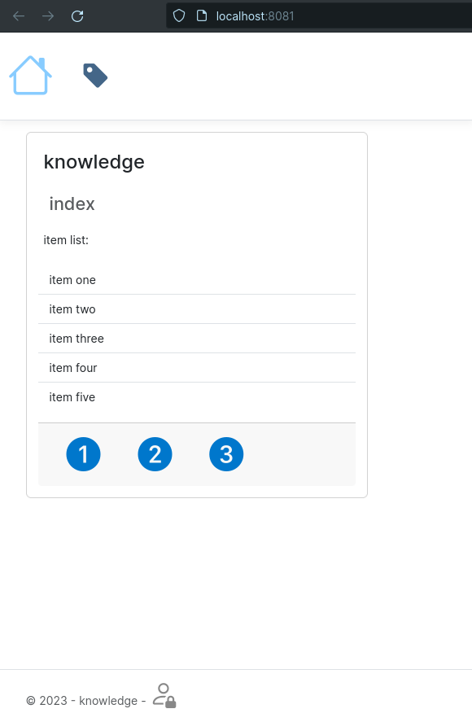

# KnowledgeRC1

Web application that offers access to machine learning features.

## Scaffolding

### I start by creating the directory that will house the entire project

```shell
mkdir KnowledgeRC1
cd KnowledgeRC1
```

### I create the file that defines the workspace

```shell
cat <<EOF | tee KnowledgeRC1.code-workspace
{
	"folders": [
		{
			"path": "."
		}
	],
	"settings": {}
}
EOF
```

### I continue to define the root of the whole project

```shell
dotnet new gitignore
echo -e "# KnowledgeRC1" > README.md
```

### Knowledge.Common project

```shell
dotnet new classlib -o Knowledge.Common
cd Knowledge.Common
rm Class1.cs
dotnet add package ClosedXML --version 0.100.3
dotnet add package Microsoft.ML --version 3.0.0-preview.22621.2
mkdir Models
echo -e "namespace Knowledge.Common.Models;\n\npublic class AssetModel {}" > Models/AssetModel.cs
echo -e "namespace Knowledge.Common.Models;\n\npublic class DataSheetModel {}" > Models/DataSheetModel.cs
echo -e "namespace Knowledge.Common.Models;\n\npublic class WorkbookModel {}" > Models/WorkbookModel.cs
```

### Knowledge.Mvc.Feather project

```shell
dotnet new web -o Knowledge.Mvc.Feather
cd Knowledge.Mvc.Feather
dotnet add ./Knowledge.Mvc.Feather.csproj reference ../Knowledge.Common/Knowledge.Common.csproj
mkdir Models
echo -e "namespace Knowledge.Mvc.Feather.Models;\n\npublic class ErrorViewModel {}" > Models/ErrorViewModel.cs
mkdir Views
touch Views/_ViewImports.cshtml
touch Views/_ViewStart.cshtml
mkdir Views/Shared
touch Views/Shared/_Layout.cshtml
touch Views/Shared/Error.cshtml
mkdir Views/Home
touch Views/Home/Index.cshtml
touch Views/Home/Upload.cshtml
touch Views/Home/Uploaded.cshtml
mkdir Views/Workbook
touch Views/Workbook/Index.cshtml
touch Views/Workbook/Workbooks.cshtml
mkdir Controllers
echo -e "namespace Knowledge.Mvc.Feather.Controllers;\n\npublic class HomeController {}" > Controllers/HomeController.cs
echo -e "namespace Knowledge.Mvc.Feather.Controllers;\n\npublic class WorkbookController {}" > Controllers/WorkbookController.cs
mkdir wwwroot
mkdir wwwroot/css
mkdir wwwroot/js
mkdir wwwroot/Store
mkdir wwwroot/Store/datasets
mkdir wwwroot/Store/workbooks
touch wwwroot/css/site.css
touch wwwroot/js/site.js
```

### After that, from within the Knowledge.Mvc.Feather directory, I can launch the web application

```shell
dotnet watch run
```

## Screenshots


